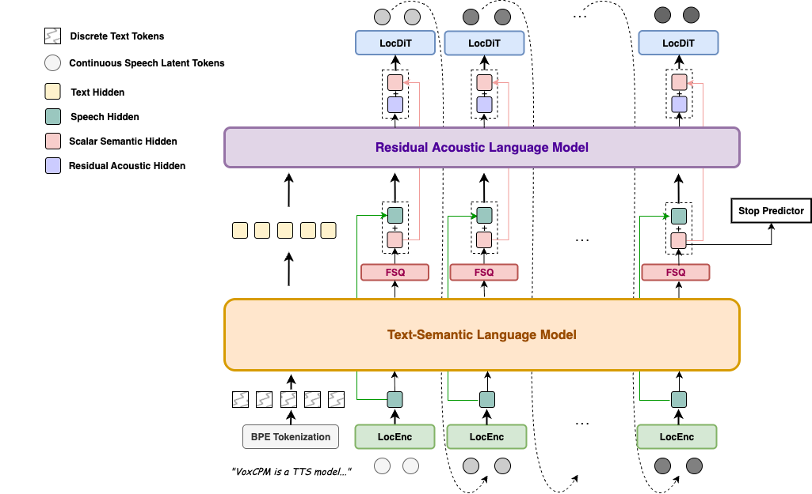

## 🎙️ VoxCPM: Tokenizer-Free TTS for Context-Aware Speech Generation and True-to-Life Voice Cloning


[](https://github.com/OpenBMB/VoxCPM/) [](https://huggingface.co/openbmb/VoxCPM-0.5B) [](https://modelscope.cn/models/OpenBMB/VoxCPM-0.5B)  [](https://huggingface.co/spaces/OpenBMB/VoxCPM-Demo) [](https://openbmb.github.io/VoxCPM-demopage)


<div align="center">
  
</div>

<div align="center">

👋 Contact us on [WeChat](assets/wechat.png)

</div>

## News 
* [2025.09.16] 🔥 🔥 🔥  We Open Source the VoxCPM-0.5B [weights](https://huggingface.co/openbmb/VoxCPM-0.5B)!
* [2025.09.16] 🎉 🎉 🎉  We Provide the [Gradio PlayGround](https://huggingface.co/spaces/OpenBMB/VoxCPM-Demo) for VoxCPM-0.5B, try it now! 

## Overview

VoxCPM is a novel tokenizer-free Text-to-Speech (TTS) system that redefines realism in speech synthesis. By modeling speech in a continuous space, it overcomes the limitations of discrete tokenization and enables two flagship capabilities: context-aware speech generation and true-to-life zero-shot voice cloning.

Unlike mainstream approaches that convert speech to discrete tokens, VoxCPM uses an end-to-end diffusion autoregressive architecture that directly generates continuous speech representations from text. Built on [MiniCPM-4](https://huggingface.co/openbmb/MiniCPM4-0.5B) backbone, it achieves implicit semantic-acoustic decoupling through hierachical language modeling and FSQ constraints, greatly enhancing both expressiveness and generation stability.

<div align="center">
  
</div>


###  🚀 Key Features
- **Context-Aware, Expressive Speech Generation** - VoxCPM comprehends text to infer and generate appropriate prosody, delivering speech with remarkable expressiveness and natural flow. It spontaneously adapts speaking style based on content, producing highly fitting vocal expression trained on a massive 1.8 million-hour bilingual corpus.
- **True-to-Life Voice Cloning** - With only a short reference audio clip, VoxCPM performs accurate zero-shot voice cloning, capturing not only the speaker’s timbre but also fine-grained characteristics such as accent, emotional tone, rhythm, and pacing to create a faithful and natural replica.
- **High-Efficiency Synthesis** - VoxCPM supports streaming synthesis with a Real-Time Factor (RTF) as low as 0.17 on a consumer-grade NVIDIA RTX 4090 GPU, making it possible for real-time applications.


##  Quick Start

### 🔧 Install from PyPI
``` sh
pip install voxcpm
```
### 1.  Model Download (Optional)
By default, when you first run the script, the model will be downloaded automatically, but you can also download the model in advance.
- Download VoxCPM-0.5B
    ```
    from huggingface_hub import snapshot_download
    snapshot_download("openbmb/VoxCPM-0.5B")
    ```
- Download ZipEnhancer and SenseVoice-Small. We use ZipEnhancer to enhance speech prompts and SenseVoice-Small for speech prompt ASR in the web demo.
    ```
    from modelscope import snapshot_download
    snapshot_download('iic/speech_zipenhancer_ans_multiloss_16k_base')
    snapshot_download('iic/SenseVoiceSmall')
    ```

### 2. Basic Usage
```python
import soundfile as sf
import numpy as np
from voxcpm import VoxCPM

model = VoxCPM.from_pretrained("openbmb/VoxCPM-0.5B")

# Non-streaming
wav = model.generate(
    text="VoxCPM is an innovative end-to-end TTS model from ModelBest, designed to generate highly expressive speech.",
    prompt_wav_path=None,      # optional: path to a prompt speech for voice cloning
    prompt_text=None,          # optional: reference text
    cfg_value=2.0,             # LM guidance on LocDiT, higher for better adherence to the prompt, but maybe worse
    inference_timesteps=10,   # LocDiT inference timesteps, higher for better result, lower for fast speed
    normalize=True,           # enable external TN tool
    denoise=True,             # enable external Denoise tool
    retry_badcase=True,        # enable retrying mode for some bad cases (unstoppable)
    retry_badcase_max_times=3,  # maximum retrying times
    retry_badcase_ratio_threshold=6.0, # maximum length restriction for bad case detection (simple but effective), it could be adjusted for slow pace speech
)

sf.write("output.wav", wav, 16000)
print("saved: output.wav")

# Streaming
chunks = []
for chunk in model.generate_streaming(
    text = "Streaming text to speech is easy with VoxCPM!",
    # supports same args as above
):
    chunks.append(chunk)
wav = np.concatenate(chunks)

sf.write("output_streaming.wav", wav, 16000)
print("saved: output_streaming.wav")
```

### 3. CLI Usage

After installation, the entry point is `voxcpm` (or use `python -m voxcpm.cli`).

```bash
# 1) Direct synthesis (single text)
voxcpm --text "VoxCPM is an innovative end-to-end TTS model from ModelBest, designed to generate highly expressive speech." --output out.wav

# 2) Voice cloning (reference audio + transcript)
voxcpm --text "VoxCPM is an innovative end-to-end TTS model from ModelBest, designed to generate highly expressive speech." \
  --prompt-audio path/to/voice.wav \
  --prompt-text "reference transcript" \
  --output out.wav \
  --denoise

# (Optinal) Voice cloning (reference audio + transcript file)
voxcpm --text "VoxCPM is an innovative end-to-end TTS model from ModelBest, designed to generate highly expressive speech." \
  --prompt-audio path/to/voice.wav \
  --prompt-file "/path/to/text-file" \
  --output out.wav \
  --denoise

# 3) Batch processing (one text per line)
voxcpm --input examples/input.txt --output-dir outs
# (optional) Batch + cloning
voxcpm --input examples/input.txt --output-dir outs \
  --prompt-audio path/to/voice.wav \
  --prompt-text "reference transcript" \
  --denoise

# 4) Inference parameters (quality/speed)
voxcpm --text "..." --output out.wav \
  --cfg-value 2.0 --inference-timesteps 10 --normalize

# 5) Model loading
# Prefer local path
voxcpm --text "..." --output out.wav --model-path /path/to/VoxCPM_model_dir
# Or from Hugging Face (auto download/cache)
voxcpm --text "..." --output out.wav \
  --hf-model-id openbmb/VoxCPM-0.5B --cache-dir ~/.cache/huggingface --local-files-only

# 6) Denoiser control
voxcpm --text "..." --output out.wav \
  --no-denoiser --zipenhancer-path iic/speech_zipenhancer_ans_multiloss_16k_base

# 7) Help
voxcpm --help
python -m voxcpm.cli --help
```

### 4. Start web demo

You can start the UI interface by running `python app.py`, which allows you to perform Voice Cloning and Voice Creation.


## 👩‍🍳 A Voice Chef's Guide
Welcome to the VoxCPM kitchen! Follow this recipe to cook up perfect generated speech. Let’s begin.

---
### 🥚 Step 1: Prepare Your Base Ingredients (Content)

First, choose how you’d like to input your text:.
1. Regular Text (Classic Mode)
- ✅ Keep "Text Normalization" ON. Type naturally (e.g., "Hello, world! 123"). The system will automatically process numbers, abbreviations, and punctuation using WeTextProcessing library.
2. Phoneme Input (Native Mode)
- ❌ Turn "Text Normalization" OFF. Enter phoneme text like {HH AH0 L OW1} (EN) or {ni3}{hao3} (ZH) for precise pronunciation  control. In this mode, VoxCPM also supports native understanding of other complex non-normalized text—try it out!

---
### 🍳 Step 2: Choose Your Flavor Profile (Voice Style) 

This is the secret sauce that gives your audio its unique sound.
1. Cooking with a Prompt Speech (Following a Famous Recipe)
  - A prompt speech provides the desired acoustic characteristics for VoxCPM. The speaker's timbre, speaking style, and even the background sounds and ambiance will be replicated.
  - For a Clean, Studio-Quality Voice:
    - ✅ Enable "Prompt Speech Enhancement". This acts like a noise filter, removing background hiss and rumble to give you a pure, clean voice clone.
2. Cooking au Naturel (Letting the Model Improvise)
  - If no reference is provided, VoxCPM becomes a creative chef! It will infer a fitting speaking style based on the text itself, thanks to the text-smartness of its foundation model, MiniCPM-4.
  - Pro Tip: Challenge VoxCPM with any text—poetry, song lyrics, dramatic monologues—it may deliver some interesting results!

---
### 🧂 Step 3: The Final Seasoning (Fine-Tuning Your Results)
You're ready to serve! But for master chefs who want to tweak the flavor, here are two key spices.
- CFG Value (How Closely to Follow the Recipe)
  - Default: A great starting point.
  - Voice sounds strained or weird? Lower this value. It tells the model to be more relaxed and improvisational, great for expressive prompts.
  - Need maximum clarity and adherence to the text? Raise it slightly to keep the model on a tighter leash.
- Inference Timesteps (Simmering Time: Quality vs. Speed)
  - Need a quick snack? Use a lower number. Perfect for fast drafts and experiments.
  - Cooking a gourmet meal? Use a higher number. This lets the model "simmer" longer, refining the audio for superior detail and naturalness.

---
Happy creating! 🎉 Start with the default settings and tweak from there to suit your project. The kitchen is yours!


---


## 📊 Performance Highlights

VoxCPM achieves competitive results on public zero-shot TTS benchmarks:

### Seed-TTS-eval Benchmark

| Model | Parameters | Open-Source | test-EN | | test-ZH | | test-Hard | |
|------|------|------|:------------:|:--:|:------------:|:--:|:-------------:|:--:|
| | | | WER/%⬇ | SIM/%⬆| CER/%⬇| SIM/%⬆ | CER/%⬇ | SIM/%⬆ |
| MegaTTS3 | 0.5B | ❌ | 2.79 | 77.1 | 1.52 | 79.0 | - | - |
| DiTAR | 0.6B | ❌ | 1.69 | 73.5 | 1.02 | 75.3 | - | - |
| CosyVoice3 | 0.5B | ❌ | 2.02 | 71.8 | 1.16 | 78.0 | 6.08 | 75.8 |
| CosyVoice3 | 1.5B | ❌ | 2.22 | 72.0 | 1.12 | 78.1 | 5.83 | 75.8 |
| Seed-TTS | - | ❌ | 2.25 | 76.2 | 1.12 | 79.6 | 7.59 | 77.6 |
| MiniMax-Speech | - | ❌ | 1.65 | 69.2 | 0.83 | 78.3 | - | - |
| CosyVoice | 0.3B | ✅ | 4.29 | 60.9 | 3.63 | 72.3 | 11.75 | 70.9 |
| CosyVoice2 | 0.5B | ✅ | 3.09 | 65.9 | 1.38 | 75.7 | **6.83** | 72.4 |
| F5-TTS | 0.3B | ✅ | 2.00 | 67.0 | 1.53 | 76.0 | 8.67 | 71.3 |
| SparkTTS | 0.5B | ✅ | 3.14 | 57.3 | 1.54 | 66.0 | - | - |
| FireRedTTS | 0.5B | ✅ | 3.82 | 46.0 | 1.51 | 63.5 | 17.45 | 62.1 |
| FireRedTTS-2 | 1.5B | ✅ | 1.95 | 66.5 | 1.14 | 73.6 | - | - |
| Qwen2.5-Omni | 7B | ✅ | 2.72 | 63.2 | 1.70 | 75.2 | 7.97 | **74.7** |
| OpenAudio-s1-mini | 0.5B | ✅ | 1.94 | 55.0 | 1.18 | 68.5 | - | - |
| IndexTTS2 | 1.5B | ✅ | 2.23 | 70.6 | 1.03 | 76.5 | - | - |
| VibeVoice | 1.5B | ✅ | 3.04 | 68.9 | 1.16 | 74.4 | - | - |
| HiggsAudio-v2 | 3B | ✅ | 2.44 | 67.7 | 1.50 | 74.0 | - | - |
| **VoxCPM** | 0.5B | ✅ | **1.85** | **72.9** | **0.93** | **77.2** | 8.87 | 73.0 |


###  CV3-eval Benchmark

| Model | zh | en | hard-zh | | | hard-en | | |
|-------|:--:|:--:|:-------:|:--:|:--:|:-------:|:--:|:--:|
| | CER/%⬇ | WER/%⬇ | CER/%⬇ | SIM/%⬆ | DNSMOS⬆ | WER/%⬇ | SIM/%⬆ | DNSMOS⬆ |
| F5-TTS | 5.47 | 8.90 | - | - | - | - | - | - |
| SparkTTS | 5.15 | 11.0 | - | - | - | - | - | - |
| GPT-SoVits | 7.34 | 12.5 | - | - | - | - | - | - |
| CosyVoice2 | 4.08 | 6.32 | 12.58 | 72.6 | 3.81 | 11.96 | 66.7 | 3.95 |
| OpenAudio-s1-mini | 4.00 | 5.54 | 18.1 | 58.2 | 3.77 | 12.4 | 55.7 | 3.89 |
| IndexTTS2 | 3.58 | 4.45 | 12.8 | 74.6 | 3.65 | - | - | - |
| HiggsAudio-v2 | 9.54 | 7.89 | 41.0 | 60.2 | 3.39 | 10.3 | 61.8 | 3.68 |
| CosyVoice3-0.5B | 3.89 | 5.24 | 14.15 | 78.6 | 3.75 | 9.04 | 75.9 | 3.92 |
| CosyVoice3-1.5B | 3.91 | 4.99 | 9.77 | 78.5 | 3.79 | 10.55 | 76.1 | 3.95 |
| **VoxCPM** | **3.40** | **4.04** | 12.9 | 66.1 | 3.59 | **7.89** | 64.3 | 3.74 |


## ⚠️ Risks and limitations
- General Model Behavior: While VoxCPM has been trained on a large-scale dataset, it may still produce outputs that are unexpected, biased, or contain artifacts.
- Potential for Misuse of Voice Cloning: VoxCPM's powerful zero-shot voice cloning capability can generate highly realistic synthetic speech. This technology could be misused for creating convincing deepfakes for purposes of impersonation, fraud, or spreading disinformation. Users of this model must not use it to create content that infringes upon the rights of individuals. It is strictly forbidden to use VoxCPM for any illegal or unethical purposes. We strongly recommend that any publicly shared content generated with this model be clearly marked as AI-generated.
- Current Technical Limitations: Although generally stable, the model may occasionally exhibit instability, especially with very long or expressive inputs. Furthermore, the current version offers limited direct control over specific speech attributes like emotion or speaking style.
- Bilingual Model: VoxCPM is trained primarily on Chinese and English data. Performance on other languages is not guaranteed and may result in unpredictable or low-quality audio.
- This model is released for research and development purposes only. We do not recommend its use in production or commercial applications without rigorous testing and safety evaluations. Please use VoxCPM responsibly.


## 📝TO-DO List
Please stay tuned for updates!
- [ ] Release the VoxCPM technical report.
- [ ] Support higher sampling rate (next version).


## 📄 License
The VoxCPM model weights and code are open-sourced under the [Apache-2.0](LICENSE) license.

## 🙏 Acknowledgments

We extend our sincere gratitude to the following works and resources for their inspiration and contributions:

- [DiTAR](https://arxiv.org/abs/2502.03930) for the diffusion autoregressive backbone used in speech generation
- [MiniCPM-4](https://github.com/OpenBMB/MiniCPM) for serving as the language model foundation
- [CosyVoice](https://github.com/FunAudioLLM/CosyVoice) for the implementation of Flow Matching-based LocDiT
- [DAC](https://github.com/descriptinc/descript-audio-codec) for providing the Audio VAE backbone

## Institutions

This project is developed by the following institutions:
-  [ModelBest](https://modelbest.cn/)

-  [THUHCSI](https://github.com/thuhcsi)


## ⭐ Star History
 [](https://star-history.com/#OpenBMB/VoxCPM&Date)


## 📚 Citation

The techical report is coming soon, please wait for the release 😊

If you find our model helpful, please consider citing our projects 📝 and staring us ⭐️！

```bib
@misc{voxcpm2025,
  author       = {{Yixuan Zhou, Guoyang Zeng, Xin Liu, Xiang Li, Renjie Yu, Ziyang Wang, Runchuan Ye, Weiyue Sun, Jiancheng Gui, Kehan Li, Zhiyong Wu, Zhiyuan Liu}},
  title        = {{VoxCPM}},
  year         = {2025},
  publish = {\url{https://github.com/OpenBMB/VoxCPM}},
  note         = {GitHub repository}
}
```
